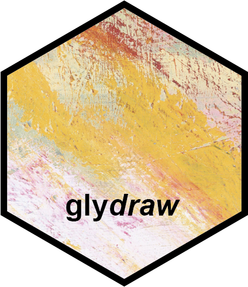
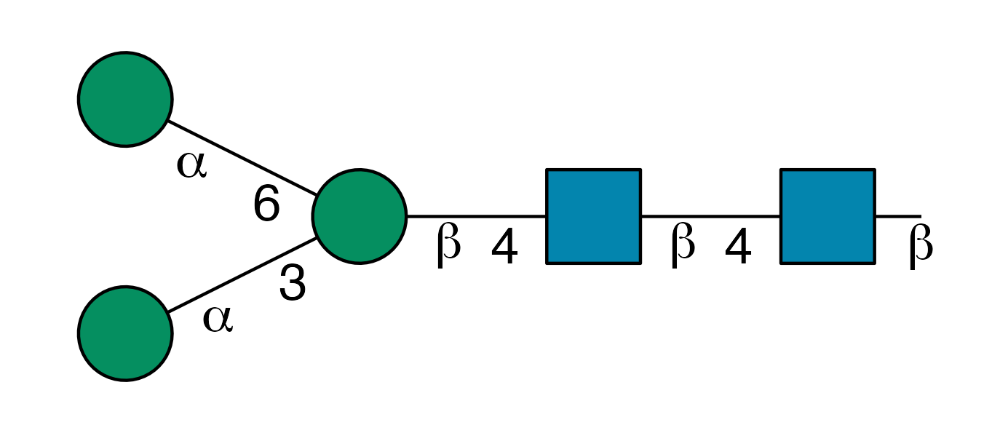

<!-- README.md is generated from README.Rmd. Please edit that file -->

```{r, include = FALSE}
knitr::opts_chunk$set(
  collapse = TRUE,
  comment = "#>",
  fig.path = "man/figures/README-",
  out.width = "100%"
)
```

# glydraw <a href="https://glycoverse.github.io/glydraw/"></a>

<!-- badges: start -->

[](https://lifecycle.r-lib.org/articles/stages.html#experimental)
[](https://CRAN.R-project.org/package=glydraw)
[](https://glycoverse.r-universe.dev/glydraw)
[](https://github.com/glycoverse/glydraw/actions/workflows/R-CMD-check.yaml)
[](https://app.codecov.io/gh/glycoverse/glydraw)

<!-- badges: end -->

The goal of glydraw is to draw published-ready Structure Nomenclature For Glycans (SNFG).
We use ggplot2 as the backend to draw the cartoons.

## Installation

You can install the latest release of glydraw from [r-universe](https://glycoverse.r-universe.dev/glydraw):

```r
install.packages('glydraw', repos = c('https://glycoverse.r-universe.dev', 'https://cloud.r-project.org'))
```

Or from [GitHub](https://github.com/glycoverse/glydraw):

``` r
# install.packages("remotes")
remotes::install_github("glycoverse/glydraw@*release")
```

Or install the development version:

``` r
remotes::install_github("glycoverse/glydraw")
```

## Example

Call `draw_cartoon()` to plot a SNFG:

```r
library(glydraw)

draw_cartoon("Man(a1-3)[Man(a1-6)]Man(b1-4)GlcNAc(b1-4)GlcNAc(b1-")
```



And call `save_cartoon()` to save it to a file:

```r
cartoon <- draw_cartoon("Man(a1-3)[Man(a1-6)]Man(b1-4)GlcNAc(b1-4)GlcNAc(b1-")
save_cartoon(cartoon, "N-core.png", dpi = 300)
```
