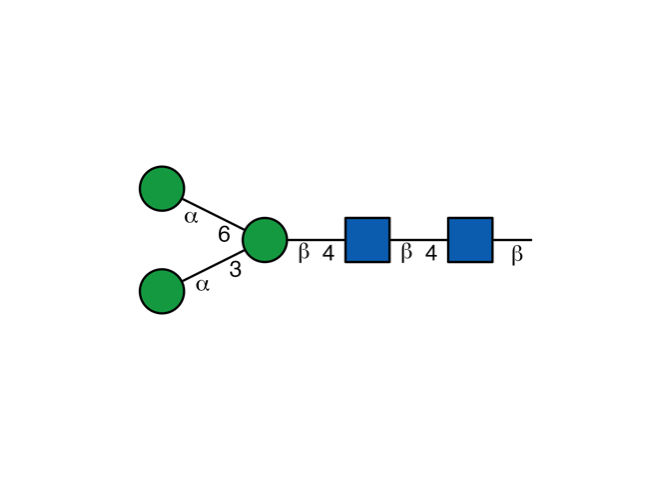
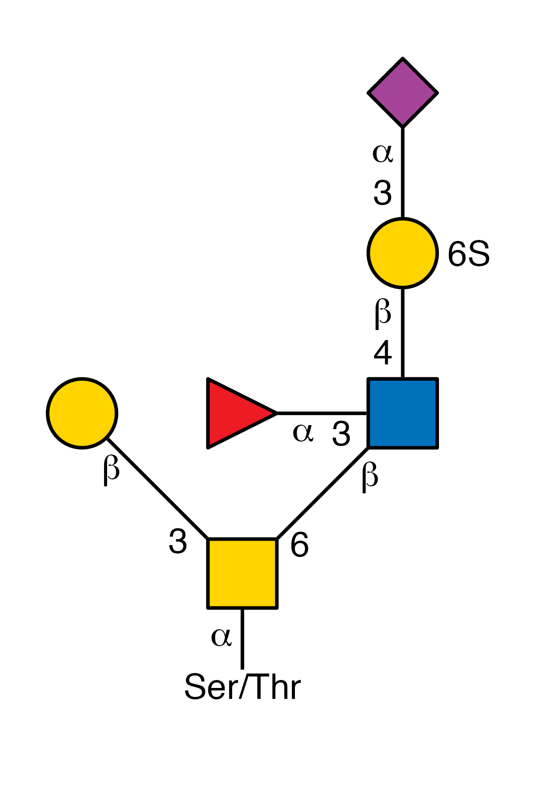

<!-- README.md is generated from README.Rmd. Please edit that file -->

```{r, include = FALSE}
knitr::opts_chunk$set(
  collapse = TRUE,
  comment = "#>",
  fig.path = "man/figures/README-",
  dpi = 300
)
```

```{r, include = FALSE}
library(glydraw)

readme_cartoon_examples <- list(
  list(
    file = "man/figures/README-unnamed-chunk-2-1.png",
    glycan = paste0(
      "Glc(a1-2)Glc(a1-3)Glc(a1-3)Man(a1-2)Man(a1-2)Man(a1-3)[Man(a1-2)Man(a1-3)",
      "[Man(a1-2)Man(a1-6)]Man(a1-6)]Man(b1-4)GlcNAc(b1-4)GlcNAc(a1-"
    ),
    args = list(red_end = "PP-Dol")
  ),
  list(
    file = "man/figures/README-unnamed-chunk-3-1.png",
    glycan = paste0(
      "Neu5Ac(a2-3)Gal(b1-3)[Fuc(a1-2)Gal(b1-3)[Fuc(a1-4)]GlcNAc(b1-3)",
      "[Gal(b1-4)[Fuc(a1-3)]GlcNAc(b1-6)]Gal(b1-4)GlcNAc(b1-6)]GalNAc(a1-"
    ),
    args = list(red_end = "~", node_size = 1.2)
  ),
  list(
    file = "man/figures/README-unnamed-chunk-4-1.png",
    glycan = "Gal(b1-3)[Neu5Ac(a2-3)Gal6S(b1-4)[Fuc(a1-3)]GlcNAc(b1-6)]GalNAc(a1-",
    args = list(orient = "V", red_end = "Ser/Thr")
  ),
  list(
    file = "man/figures/README-unnamed-chunk-5-1.png",
    glycan = "Fuc(a1-3)[Fuc(a1-6)]GlcNAc(b1-",
    args = list(orient = "V", red_end = "Asn", fuc_orient = "up")
  ),
  list(
    file = "man/figures/README-unnamed-chunk-6-1.png",
    glycan = paste0(
      "WURCS=2.0/3,4,3/[a2122h-1a_1-5_2*N][a1122h-1a_1-5_2*OP^XOCCN/3O/3=O]",
      "[a1122h-1a_1-5_6*OP^XOCCN/3O/3=O]/1-2-3-3/a4-b1_b6-c1_c2-d1"
    ),
    args = list()
  )
)

purrr::walk(readme_cartoon_examples, function(example) {
  cartoon <- do.call(draw_cartoon, c(list(example$glycan), example$args))
  save_cartoon(cartoon, example$file)
})
```

# glydraw <a href="https://glycoverse.github.io/glydraw/"></a>

<!-- badges: start -->

[](https://lifecycle.r-lib.org/articles/stages.html#experimental)
[](https://glycoverse.r-universe.dev/glydraw)
[](https://github.com/glycoverse/glydraw/actions/workflows/R-CMD-check.yaml)
[](https://app.codecov.io/gh/glycoverse/glydraw)

<!-- badges: end -->

`glydraw` is a ggplot2-native R engine for drawing reproducible SNFG glycan cartoons from glycan structure objects or text notations,
with support for batch export, structural highlighting, and deep appearance customization.

## Installation

### Install glycoverse

We recommend installing the meta-package [glycoverse](https://github.com/glycoverse/glycoverse),
which includes this package and other core glycoverse packages.

### Install glydraw alone

If you don't want to install all glycoverse packages, you can only install glydraw.

You can install the latest release of glydraw from [r-universe](https://glycoverse.r-universe.dev/glydraw) (**recommended**):

```r
# install.packages("pak")
pak::repo_add(glycoverse = "https://glycoverse.r-universe.dev")
pak::pkg_install("glydraw")
```

Or from [GitHub](https://github.com/glycoverse/glydraw):

``` r
pak::pkg_install("glycoverse/glydraw@*release")
```

Or install the development version (NOT recommended):

``` r
pak::pkg_install("glycoverse/glydraw")
```

**Note:** Tips and troubleshooting for the meta-package [glycoverse](https://github.com/glycoverse/glycoverse)
are also applicable here: [Installation of glycoverse](https://github.com/glycoverse/glycoverse#installation).

## Example

``` r
library(glydraw)

glycan <- paste0(
  "Glc(a1-2)Glc(a1-3)Glc(a1-3)Man(a1-2)Man(a1-2)Man(a1-3)[Man(a1-2)Man(a1-3)",
  "[Man(a1-2)Man(a1-6)]Man(a1-6)]Man(b1-4)GlcNAc(b1-4)GlcNAc(a1-"
)
draw_cartoon(glycan, red_end = "PP-Dol")
```

<!-- -->

``` r
glycan <- paste0(
  "Neu5Ac(a2-3)Gal(b1-3)[Fuc(a1-2)Gal(b1-3)[Fuc(a1-4)]GlcNAc(b1-3)",
  "[Gal(b1-4)[Fuc(a1-3)]GlcNAc(b1-6)]Gal(b1-4)GlcNAc(b1-6)]GalNAc(a1-"
)
draw_cartoon(glycan, red_end = "~", node_size = 1.2)
```

<!-- -->

``` r
glycan <- "Gal(b1-3)[Neu5Ac(a2-3)Gal6S(b1-4)[Fuc(a1-3)]GlcNAc(b1-6)]GalNAc(a1-"
draw_cartoon(glycan, orient = "V", red_end = "Ser/Thr")
```

<!-- -->

``` r
glycan <- "Fuc(a1-3)[Fuc(a1-6)]GlcNAc(b1-"
draw_cartoon(glycan, orient = "V", red_end = "Asn", fuc_orient = "up")
```

<!-- -->

``` r
glycan <- paste0(
  "WURCS=2.0/3,4,3/[a2122h-1a_1-5_2*N][a1122h-1a_1-5_2*OP^XOCCN/3O/3=O]",
  "[a1122h-1a_1-5_6*OP^XOCCN/3O/3=O]/1-2-3-3/a4-b1_b6-c1_c2-d1"
)
draw_cartoon(glycan)
```

<!-- -->
