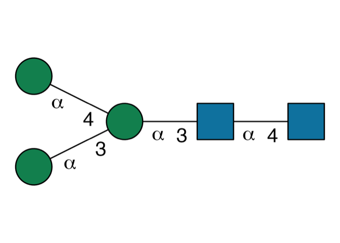
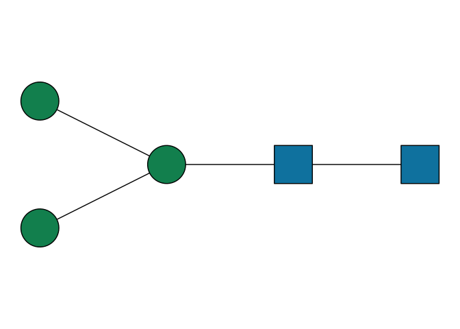
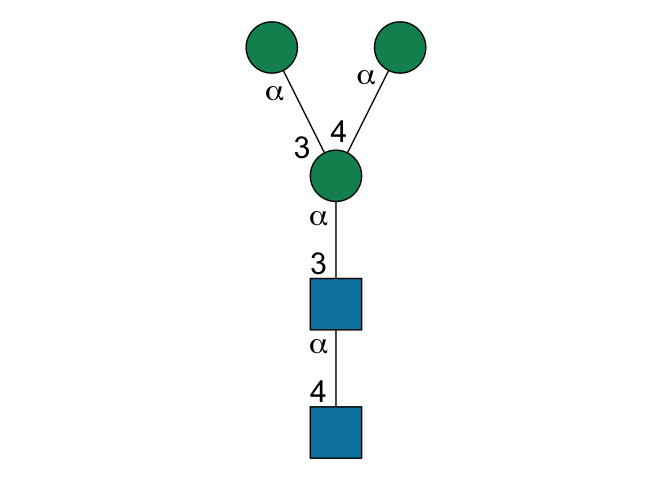

<!-- README.md is generated from README.Rmd. Please edit that file -->

# glydraw

<!-- badges: start -->

[](https://lifecycle.r-lib.org/articles/stages.html#experimental) [](https://CRAN.R-project.org/package=glydraw) [](https://github.com/glycoverse/glydraw/actions/workflows/R-CMD-check.yaml) [](https://app.codecov.io/gh/glycoverse/glydraw)

<!-- badges: end -->

The goal of glydraw is to draw glycan structures with glycan nomenclature.

## Installation

You can install the latest release of glydraw from [GitHub](https://github.com/) with:

``` r
# install.packages("remotes")
remotes::install_github("glycoverse/glydraw@*release")
```

Or install the development version:

``` r
remotes::install_github("glycoverse/glydraw")
```

## Example

This is a basic example which shows you how to solve a common problem:

``` r
library(glydraw)
# basic example code
draw_cartoon("Man(a1-3)[Man(a1-4)]Man(a1-3)GlcNAc(a1-4)GlcNAc(a1-")
```



``` r
# If you want to hide the annotation (default add annotation):
draw_cartoon("Man(a1-3)[Man(a1-4)]Man(a1-3)GlcNAc(a1-4)GlcNAc(a1-", annotate = FALSE)
```



``` r
# If you want to draw structure vertically (default horizontally):
draw_cartoon("Man(a1-3)[Man(a1-4)]Man(a1-3)GlcNAc(a1-4)GlcNAc(a1-", orien = 'V')
```



It is necessary to declare that pictures displayed in RStudio is different from those saved with `save_cartoon()`, because the size need to be dynamically adjusted by `save_cartoon()`. You can check the correct glycan pictures after saved by `save_cartoon()`.
