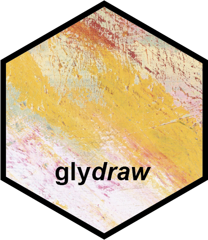
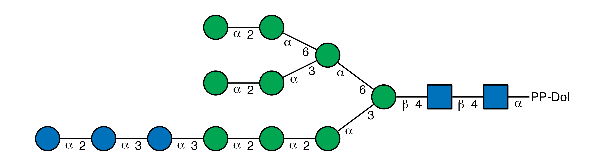
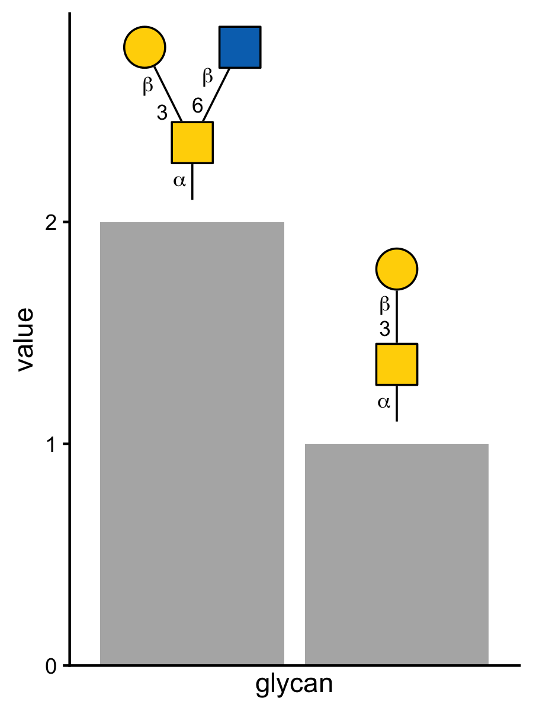
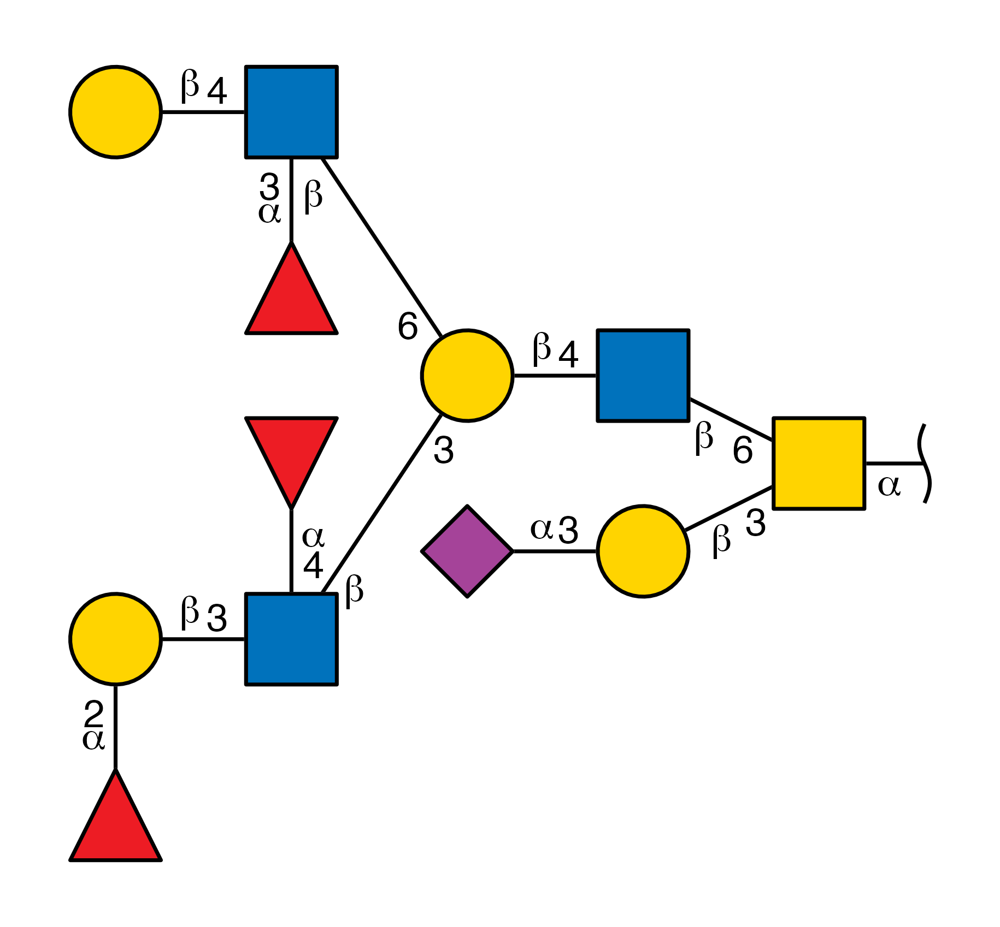
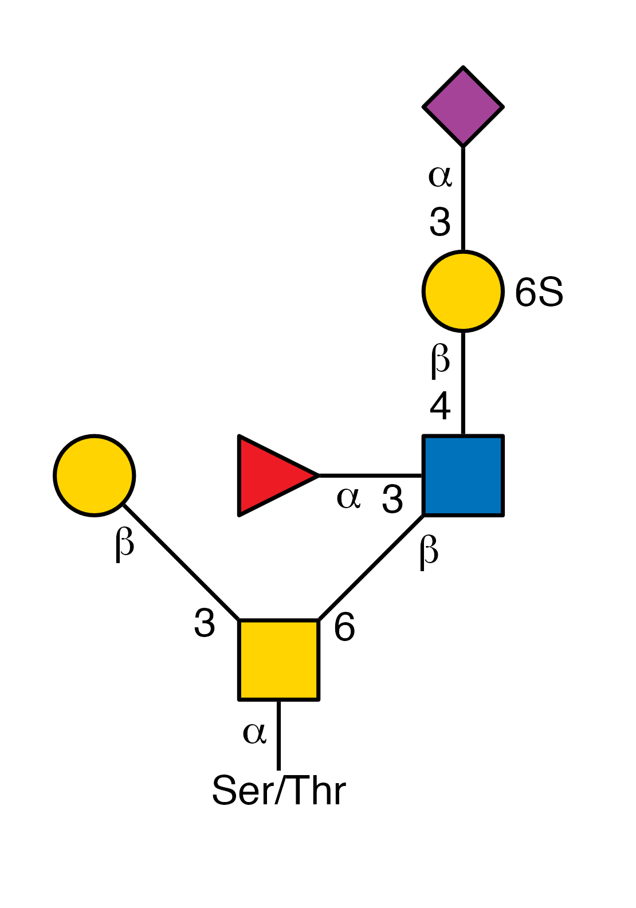
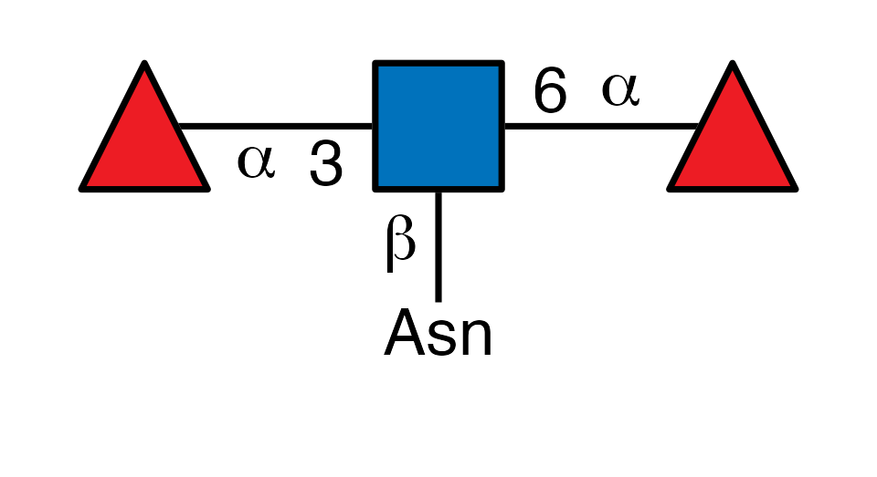
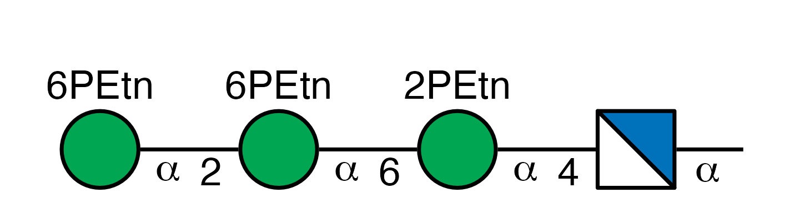
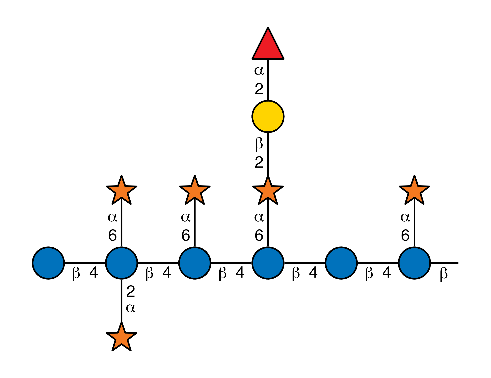

<!-- README.md is generated from README.Rmd. Please edit that file -->

# glydraw <a href="https://glycoverse.github.io/glydraw/"></a>

<!-- badges: start -->

[](https://lifecycle.r-lib.org/articles/stages.html#experimental)
[](https://CRAN.R-project.org/package=glydraw)
[](https://glycoverse.r-universe.dev/glydraw)
[](https://github.com/glycoverse/glydraw/actions/workflows/R-CMD-check.yaml)
[](https://app.codecov.io/gh/glycoverse/glydraw)

<!-- badges: end -->

`glydraw` is a ggplot2-native R engine for drawing reproducible SNFG
glycan cartoons from glycan structure objects or text notations, with
support for batch export, structural highlighting, and deep appearance
customization.

## Installation

### Install glycoverse

We recommend installing the meta-package
[glycoverse](https://github.com/glycoverse/glycoverse), which includes
this package and other core glycoverse packages.

### Install glydraw alone

If you don’t want to install all glycoverse packages, you can only
install glydraw.

You can install the latest release of glydraw from
[CRAN](https://CRAN.R-project.org/package=glydraw):

``` r
pak::pkg_install("glydraw")
```

Or from [r-universe](https://glycoverse.r-universe.dev/glydraw):

``` r
pak::repo_add(glycoverse = "https://glycoverse.r-universe.dev")
pak::pkg_install("glydraw")
```

Or install the latest GitHub release:

``` r
pak::pkg_install("glycoverse/glydraw@*release")
```

Or install the development version from
[GitHub](https://github.com/glycoverse/glydraw):

``` r
pak::pkg_install("glycoverse/glydraw")
```

## Example

### Plot one glycan

``` r
library(glydraw)

glycan <- paste0(
  "Glc(a1-2)Glc(a1-3)Glc(a1-3)Man(a1-2)Man(a1-2)Man(a1-3)[Man(a1-2)Man(a1-3)",
  "[Man(a1-2)Man(a1-6)]Man(a1-6)]Man(b1-4)GlcNAc(b1-4)GlcNAc(a1-"
)
draw_cartoon(glycan, style = style_glydraw(red_end = "PP-Dol"))
```



### ggplot2 extension

`scale_x_glycan()` and `scale_y_glycan()` can add glycan cartoons to
standard ggplot2 figures. For example, you can use glycan cartoons as
labels in a heatmap:

``` r
library(ggplot2)
library(glydraw)
library(tibble)

set.seed(123)
plot_data <- tibble(
  `z-score` = rnorm(25),
  branch = rep(c(
    "GlcNAc(??-",
    "Gal(??-?)GlcNAc(??-",
    "Neu5Ac(??-?)Gal(??-?)GlcNAc(??-",
    "Neu5Ac(??-?)Gal(??-?)[Fuc(??-?)]GlcNAc(??-",
    "Gal(??-?)[Fuc(??-?)]GlcNAc(??-"
  ), 5),
  sample = rep(paste0("Sample ", 1:5), each = 5)
)

ggplot(plot_data, aes(branch, sample)) +
  geom_tile(aes(fill = `z-score`), color = "white", linewidth = 1) +
  scale_fill_viridis_c(option = "plasma") +
  scale_x_glycan(
    position = "top",
    size = 0.2,
    show_linkage = FALSE,
    style = style_glydraw(red_end = "~")
  ) +
  coord_equal() +
  theme_void() +
  theme(axis.text.y = element_text())
```

<!-- -->

### Gallery

``` r
glycan <- paste0(
  "Neu5Ac(a2-3)Gal(b1-3)[Fuc(a1-2)Gal(b1-3)[Fuc(a1-4)]GlcNAc(b1-3)",
  "[Gal(b1-4)[Fuc(a1-3)]GlcNAc(b1-6)]Gal(b1-4)GlcNAc(b1-6)]GalNAc(a1-"
)
draw_cartoon(
  glycan,
  style = style_glydraw(red_end = "~", node_size = 1.2)
)
```



``` r
glycan <- "Gal(b1-3)[Neu5Ac(a2-3)Gal6S(b1-4)[Fuc(a1-3)]GlcNAc(b1-6)]GalNAc(a1-"
draw_cartoon(
  glycan,
  orient = "up",
  style = style_glydraw(red_end = "Ser/Thr")
)
```



``` r
glycan <- "Fuc(a1-3)[Fuc(a1-6)]GlcNAc(b1-"
draw_cartoon(
  glycan,
  orient = "up",
  style = style_glydraw(red_end = "Asn", fuc_orient = "up")
)
```



``` r
glycan <- paste0(
  "WURCS=2.0/3,4,3/[a2122h-1a_1-5_2*N][a1122h-1a_1-5_2*OP^XOCCN/3O/3=O]",
  "[a1122h-1a_1-5_6*OP^XOCCN/3O/3=O]/1-2-3-3/a4-b1_b6-c1_c2-d1"
)
draw_cartoon(glycan)
```



``` r
glycan <- "Glc(b1-4)[Xyl(a1-6)][Xyl(a1-2)]Glc(b1-4)[Xyl(a1-6)]Glc(b1-4)[Fuc(a1-2)Gal(b1-2)Xyl(a1-6)]Glc(b1-4)Glc(b1-4)[Xyl(a1-6)]Glc(b1-"
draw_cartoon(glycan, style = style_glydraw(fuc_orient = "up"))
```


