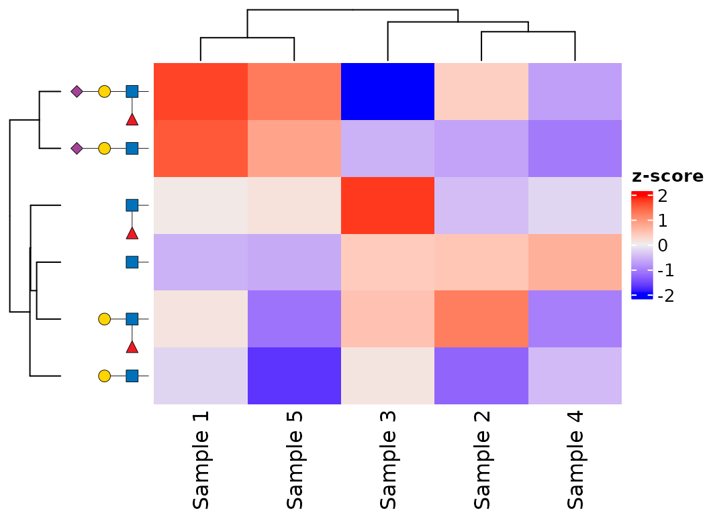
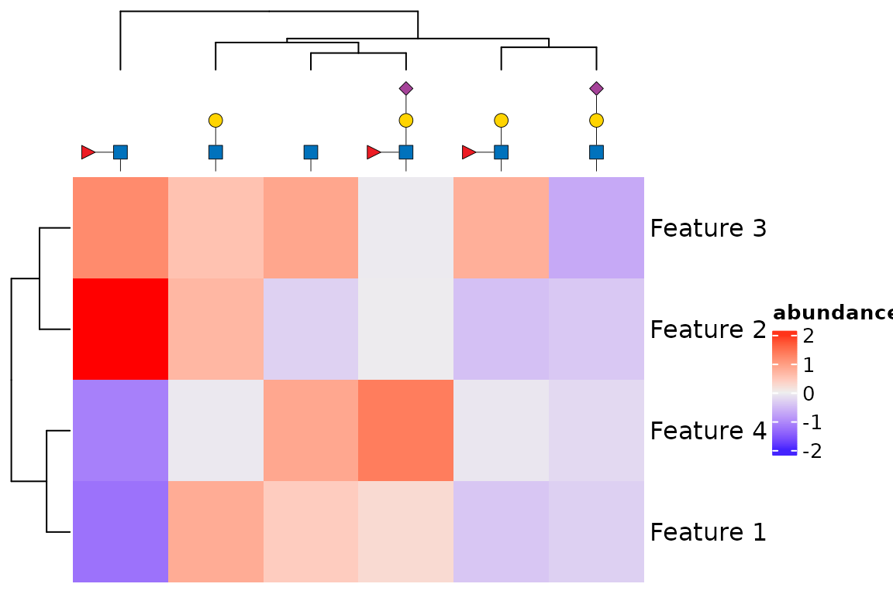
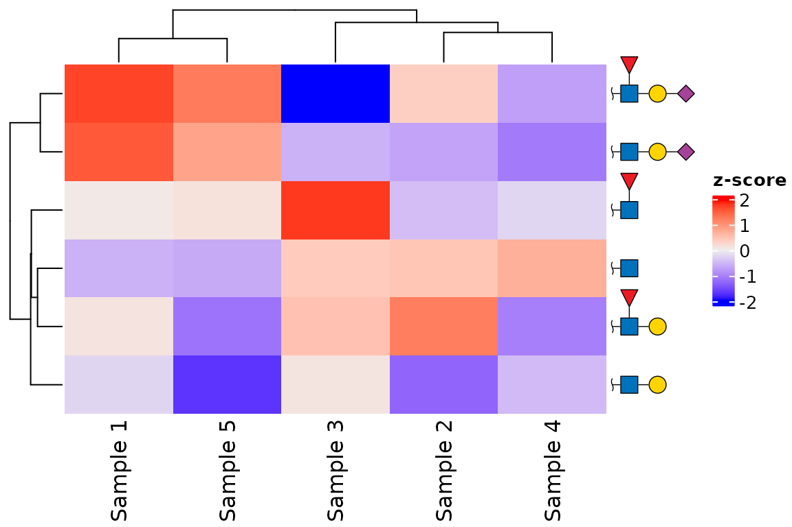

# glydraw with ComplexHeatmap

[`ComplexHeatmap`](https://jokergoo.github.io/ComplexHeatmap-reference/book/)
provides flexible annotations for heatmap rows and columns. `glydraw`
extends those annotations with
[`anno_glycan()`](https://glycoverse.github.io/glydraw/reference/anno_glycan.md),
which draws SNFG cartoons in their place. This is useful when rows or
columns represent glycans and their structures are more informative than
text labels.

`ComplexHeatmap` is a suggested package, so install it before using this
vignette if necessary.

``` r

install.packages("BiocManager")
BiocManager::install("ComplexHeatmap")
```

``` r

library(glydraw)
suppressPackageStartupMessages(library(ComplexHeatmap))
```

## Label a heatmap with glycans

Pass one glycan structure for each row or column being labelled. The
order of the `structure` vector must match the corresponding dimension
of the matrix.
[`anno_glycan()`](https://glycoverse.github.io/glydraw/reference/anno_glycan.md)
returns an annotation that can be used in
[`rowAnnotation()`](https://rdrr.io/pkg/ComplexHeatmap/man/rowAnnotation.html)
or
[`HeatmapAnnotation()`](https://rdrr.io/pkg/ComplexHeatmap/man/HeatmapAnnotation.html).

``` r

set.seed(123)
structures <- c(
  "GlcNAc(b1-",
  "Gal(b1-4)GlcNAc(b1-",
  "Neu5Ac(a2-?)Gal(b1-4)GlcNAc(b1-",
  "Fuc(a1-3)GlcNAc(b1-",
  "Gal(b1-4)[Fuc(a1-3)]GlcNAc(b1-",
  "Neu5Ac(a2-?)Gal(b1-4)[Fuc(a1-3)]GlcNAc(b1-"
)

mat <- matrix(
  rnorm(length(structures) * 5),
  nrow = length(structures),
  dimnames = list(NULL, paste0("Sample ", 1:5))
)
```

Here, the row labels appear on the left. Set `show_row_names = FALSE`
because the cartoons replace the usual row names. The annotation follows
the heatmap’s row order, so it remains attached to the right glycan
after clustering, reordering, or splitting.

``` r

Heatmap(
  mat,
  name = "z-score",
  show_row_names = FALSE,
  left_annotation = rowAnnotation(
    glycan = anno_glycan(
      structures,
      which = "row",
      size = 0.2,
      show_linkage = FALSE
    )
  )
)
```



## Use glycans as column labels

Column annotations work the same way. The default orientation is
vertical for column labels and horizontal for row labels, with the
reducing end anchoring each cartoon next to the heatmap. The `side` must
be compatible with the annotation placement: use `"top"` or `"bottom"`
for columns, and `"left"` or `"right"` for rows.

``` r

glycan_mat <- matrix(
  rnorm(length(structures) * 4),
  ncol = length(structures),
  dimnames = list(paste0("Feature ", 1:4), NULL)
)

Heatmap(
  glycan_mat,
  name = "abundance",
  show_column_names = FALSE,
  top_annotation = HeatmapAnnotation(
    glycan = anno_glycan(
      structures,
      which = "column",
      side = "top",
      size = 0.2,
      show_linkage = FALSE
    )
  )
)
```



## Control the annotation appearance

The annotation accepts the same drawing controls that glycan scales use.
`size`, `angle`, `hjust`, `vjust`, `nudge_x`, and `nudge_y` adjust
placement; `show_linkage`, `style`, and `red_end` control the cartoons
themselves. The required row `width` or column `height` is calculated
automatically from the rendered cartoons. Supply a
[`grid::unit()`](https://rdrr.io/r/grid/unit.html) value only when you
need a fixed annotation extent.

This example uses compact labels with linkage text suppressed, a wavy
reducing end, and a right-side row annotation.

``` r

Heatmap(
  mat,
  name = "z-score",
  show_row_names = FALSE,
  right_annotation = rowAnnotation(
    glycan = anno_glycan(
      structures,
      which = "row",
      side = "right",
      orient = "right",
      size = 0.2,
      show_linkage = FALSE,
      style = style_glydraw(
        red_end = "~",
        node_size = 1.4,
        edge_linewidth = 1.2,
        node_linewidth = 1.2
      )
    )
  )
)
```



## Keep labels aligned with the data

Create the annotation from the same vector used to construct the heatmap
matrix. Do not reorder the structures manually to match a dendrogram:
`ComplexHeatmap` supplies the final row or column indices to
[`anno_glycan()`](https://glycoverse.github.io/glydraw/reference/anno_glycan.md)
when it draws each heatmap slice. This also preserves alignment when you
use `row_split`, `column_split`, or explicit row and column orders.

For additional drawing options, see
[`?anno_glycan`](https://glycoverse.github.io/glydraw/reference/anno_glycan.md)
and the `glydraw as a ggplot2 extension` vignette.
