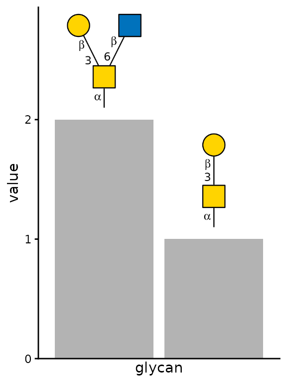
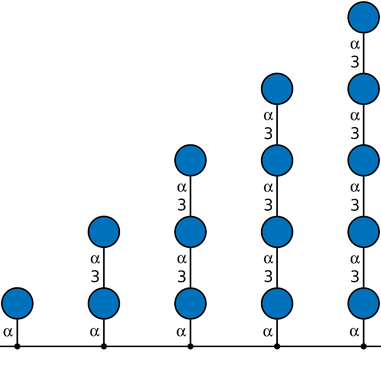
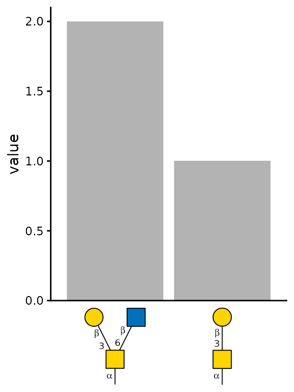
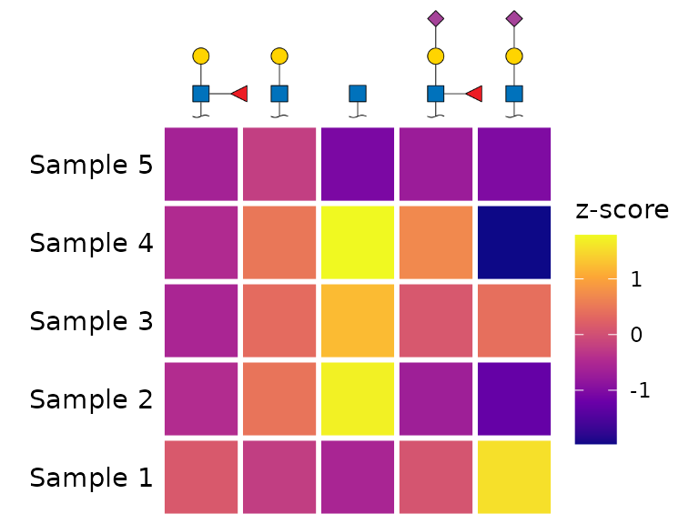
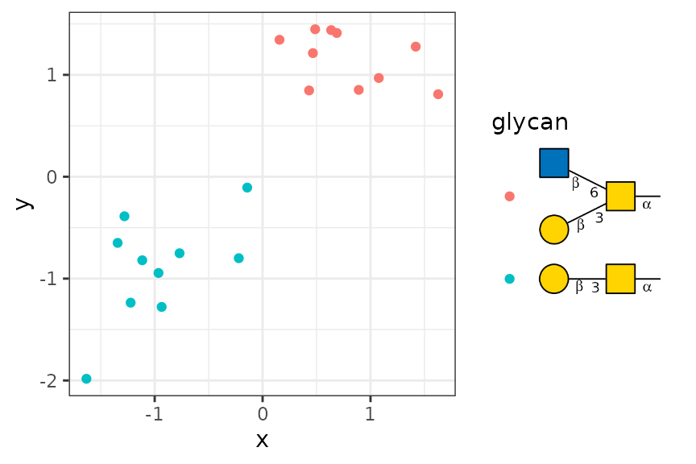

# glydraw as a ggplot2 extension

Plotting glycan SNFG cartoons is useful on its own. However, we often
want to include them in figures such as heatmaps or bar plots. `glydraw`
supports this use case with
[`geom_glycan()`](https://glycoverse.github.io/glydraw/reference/geom_glycan.md),
[`scale_x_glycan()`](https://glycoverse.github.io/glydraw/reference/scale_x_glycan.md)
/
[`scale_y_glycan()`](https://glycoverse.github.io/glydraw/reference/scale_x_glycan.md),
and
[`guide_glycan()`](https://glycoverse.github.io/glydraw/reference/guide_glycan.md).

``` r

library(glydraw)
library(tibble)
library(dplyr)
#> 
#> Attaching package: 'dplyr'
#> The following objects are masked from 'package:stats':
#> 
#>     filter, lag
#> The following objects are masked from 'package:base':
#> 
#>     intersect, setdiff, setequal, union
library(ggplot2)
```

## `geom_glycan()`

Let’s start with the simplest function,
[`geom_glycan()`](https://glycoverse.github.io/glydraw/reference/geom_glycan.md).
It is similar to
[`geom_text()`](https://ggplot2.tidyverse.org/reference/geom_text.html)
or
[`geom_label()`](https://ggplot2.tidyverse.org/reference/geom_text.html),
but plots glycan cartoons instead of text. Therefore, you need to
provide a third aesthetic in addition to `x` and `y`, namely
`structure`, just as you provide `label` for
[`geom_text()`](https://ggplot2.tidyverse.org/reference/geom_text.html).

``` r

plot_data <- tibble(
  glycan = c("Gal(b1-3)GalNAc(a1-", "Gal(b1-3)[GlcNAc(b1-6)]GalNAc(a1-"),
  value = c(1, 2),
)

ggplot(plot_data, aes(glycan, value)) +
  geom_col(fill = "grey70") +
  # ===== Important Here =====
  geom_glycan(
    aes(structure = glycan),  # provide a `structure` aesthetic
    orient = "V",             # set orientation to vertical
    size = 0.5,               # default 1 is too large
    vjust = 0,                # aligned to bottom
    position = position_nudge(y = 0.1)
  ) +
  # ==========================
  scale_y_continuous(expand = expansion(mult = c(0, 0.4))) +
  theme_classic() +
  theme(
    axis.text.x = element_blank(),
    axis.ticks.x = element_blank()
  )
```



The `structure` aesthetic can be a character vector supported by
[`glyparse::auto_parse()`](https://glycoverse.github.io/glyparse/reference/auto_parse.html),
as in the example above. It can also be a
[`glyrepr::glycan_structure()`](https://glycoverse.github.io/glyrepr/reference/glycan_structure.html)
vector.

Technically, you can provide the `structure` aesthetic in
[`ggplot()`](https://ggplot2.tidyverse.org/reference/ggplot.html), but
we recommend using it only in
[`geom_glycan()`](https://glycoverse.github.io/glydraw/reference/geom_glycan.md),
because other geoms simply ignore `structure`. Keeping it in
[`geom_glycan()`](https://glycoverse.github.io/glydraw/reference/geom_glycan.md)
also makes the code more readable.

``` r

# Don't do this
ggplot(aes(x, y, structure = glycan)) +
  geom_glycan()

# Do this
ggplot(aes(x, y)) +
  geom_glycan(aes(structure = glycan))
```

You may also have noticed that
[`geom_glycan()`](https://glycoverse.github.io/glydraw/reference/geom_glycan.md)
inherits all the styling arguments from
[`draw_cartoon()`](https://glycoverse.github.io/glydraw/reference/draw_cartoon.md).
You will often need to adjust these arguments, because placing glycan
cartoons in a figure requires careful attention to ensure that they look
good alongside the other components. There are no universal defaults.

With a little creativity,
[`geom_glycan()`](https://glycoverse.github.io/glydraw/reference/geom_glycan.md)
can be used to create a variety of plots.

``` r

plot_data <- tibble(
  y = 0,
  x = 1:5,
  glycan = c(
    "Glc(a1-",
    "Glc(a1-3)Glc(a1-",
    "Glc(a1-3)Glc(a1-3)Glc(a1-",
    "Glc(a1-3)Glc(a1-3)Glc(a1-3)Glc(a1-",
    "Glc(a1-3)Glc(a1-3)Glc(a1-3)Glc(a1-3)Glc(a1-"
  ),
)

ggplot(plot_data, aes(x, y)) +
  # ===== Important Here =====
  geom_glycan(
    aes(structure = glycan),
    size = 0.7,
    vjust = 0,
    orient = "V"
  ) +
  # ==========================
  geom_hline(yintercept = 0) +
  geom_point() +
  scale_y_continuous(expand = expansion(mult = c(0.05, 0.5))) +
  theme_void()
```



## `scale_x_glycan()` / `scale_y_glycan()`

These functions are similar to
[`scale_x_discrete()`](https://ggplot2.tidyverse.org/reference/scale_discrete.html)
and
[`scale_y_discrete()`](https://ggplot2.tidyverse.org/reference/scale_discrete.html),
except that they plot glycan cartoons as “axis text”. To use them, set
`x` or `y` to glycan structures.

``` r

# the same example data above
plot_data <- tibble(
  glycan = c("Gal(b1-3)GalNAc(a1-", "Gal(b1-3)[GlcNAc(b1-6)]GalNAc(a1-"),
  value = c(1, 2),
)

# This time, we plot glycan cartoons below the x-axis.
ggplot(plot_data, aes(x = glycan, y = value)) +
  geom_col(fill = "grey70") +
  scale_x_glycan() +  # The default values are good here.
  scale_y_continuous(expand = expansion(mult = c(0, 0.05))) +
  theme_classic() +
  theme(
    axis.ticks.x = element_blank(),
    axis.title.x = element_blank()
  )
```



Here is another example.
[`scale_x_glycan()`](https://glycoverse.github.io/glydraw/reference/scale_x_glycan.md)
and
[`scale_y_glycan()`](https://glycoverse.github.io/glydraw/reference/scale_x_glycan.md)
can be useful for heatmaps.

``` r

set.seed(123)
plot_data <- tibble(
  `z-score` = rnorm(25),
  branch = rep(c(
    "GlcNAc(??-",
    "Gal(??-?)GlcNAc(??-",
    "Neu5Ac(??-?)Gal(??-?)GlcNAc(??-",
    "Neu5Ac(??-?)Gal(??-?)[Fuc(??-?)]GlcNAc(??-",
    "Gal(??-?)[Fuc(??-?)]GlcNAc(??-"
  ), 5),
  sample = rep(paste0("Sample ", 1:5), each = 5)
)

ggplot(plot_data, aes(branch, sample)) +
  geom_tile(aes(fill = `z-score`), color = "white", linewidth = 1) +
  scale_fill_viridis_c(option = "plasma") +
  # ===== Important Here =====
  scale_x_glycan(
    position = "top",
    size = 0.2,
    show_linkage = FALSE,
    red_end = "~"
  ) +
  # ==========================
  coord_equal() +
  theme_void() +
  theme(axis.text.y = element_text())
```



Notice that the signatures of
[`scale_x_glycan()`](https://glycoverse.github.io/glydraw/reference/scale_x_glycan.md)
and
[`scale_y_glycan()`](https://glycoverse.github.io/glydraw/reference/scale_x_glycan.md)
set the `hjust` and `vjust` defaults to
[`hjust_red_end()`](https://glycoverse.github.io/glydraw/reference/hjust_red_end.md)
and
[`vjust_red_end()`](https://glycoverse.github.io/glydraw/reference/hjust_red_end.md),
respectively. These defaults anchor the cartoons in the heatmap at their
reducing ends, rather than at their centers. You can change `hjust` or
`vjust` to a numeric value if needed.

## `guide_glycan()`

This function may be less commonly used than the functions above, which
put glycan cartoons in the panel or on an axis, but it fills the gap of
putting cartoons in a legend. It uses the recommended grammar from
ggplot2 4.0.0. It may not work correctly with older versions of ggplot2.

``` r

set.seed(123)
plot_data <- bind_rows(
  tibble(
    x = rnorm(10, mean = -1, sd = 0.5),
    y = rnorm(10, mean = -1, sd = 0.5),
    glycan = "Gal(b1-3)GalNAc(a1-"
  ),
  tibble(
    x = rnorm(10, mean = 1, sd = 0.5),
    y = rnorm(10, mean = 1, sd = 0.5),
    glycan = "Gal(b1-3)[GlcNAc(b1-6)]GalNAc(a1-"
  )
)

ggplot(plot_data, aes(x, y)) +
  geom_point(aes(color = glycan)) +
  guides(color = guide_glycan()) +  # Done!
  theme_bw()
```



## `geom_node_glycan()`

There is also
[`geom_node_glycan()`](https://glycoverse.github.io/glydraw/reference/geom_node_glycan.md),
an extension to `ggraph`. You can use it in place of
[`ggraph::geom_node_point()`](https://ggraph.data-imaginist.com/reference/geom_node_point.html)
to plot glycan cartoons as nodes. Everything else should be familiar now
that you have seen the functions above. Try it yourself!
