# Get Started with glydraw

`glydraw` draws SNFG glycan cartoons from glycan structure text or
[`glyrepr::glycan_structure()`](https://glycoverse.github.io/glyrepr/reference/glycan_structure.html)
objects. The main workflow is:

1.  Draw one glycan with
    [`draw_cartoon()`](https://glycoverse.github.io/glydraw/dev/reference/draw_cartoon.md).
2.  Save one cartoon with
    [`save_cartoon()`](https://glycoverse.github.io/glydraw/dev/reference/save_cartoon.md).
3.  Export many cartoons with
    [`export_cartoons()`](https://glycoverse.github.io/glydraw/dev/reference/export_cartoons.md).

This vignette uses IUPAC-condensed strings because they are compact and
easy to copy into examples.

``` r

library(glydraw)
```

## Draw one glycan

The first argument, `structure`, is the glycan to draw. It can be a
character string in a notation supported by
[`glyparse::auto_parse()`](https://glycoverse.github.io/glyparse/reference/auto_parse.html),
or a
[`glyrepr::glycan_structure()`](https://glycoverse.github.io/glyrepr/reference/glycan_structure.html)
value.

``` r

n_core <- "Man(a1-3)[Man(a1-6)]Man(b1-4)GlcNAc(b1-4)GlcNAc(b1-"

draw_cartoon(n_core)
```

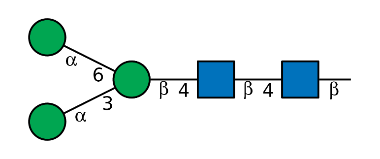

## Drawing parameters

[`draw_cartoon()`](https://glycoverse.github.io/glydraw/dev/reference/draw_cartoon.md)
returns a ggplot2 object with class `glydraw_cartoon`. You can print it
directly, pass it to
[`save_cartoon()`](https://glycoverse.github.io/glydraw/dev/reference/save_cartoon.md),
or add normal ggplot2 layers when needed.

### `show_linkage`

`show_linkage` controls whether glycosidic linkage annotations are
shown. Substituent annotations are always shown.

``` r

draw_cartoon(n_core, show_linkage = FALSE)
```

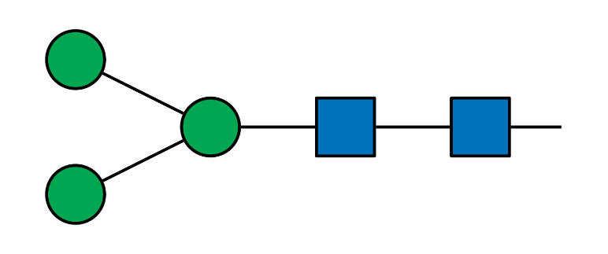

### `orient`

`orient` controls the overall direction of the cartoon. Use `"H"` for
the default horizontal layout or `"V"` for a vertical layout.

``` r

draw_cartoon(n_core, orient = "V")
```

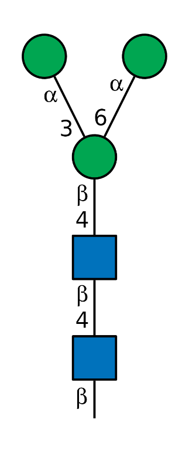

### `fuc_orient`

`fuc_orient` controls how Fuc triangles are rotated. The default,
`"flex"`, points non-reducing Fuc residues toward their rendered linkage
direction. Use `"up"` when every Fuc triangle should point upward.

``` r

fucosylated <- "Gal(b1-3)[Fuc(a1-4)]GlcNAc(b1-"

draw_cartoon(fucosylated, fuc_orient = "flex")
```

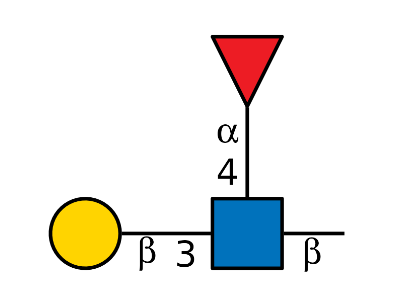

``` r

draw_cartoon(fucosylated, fuc_orient = "up")
```

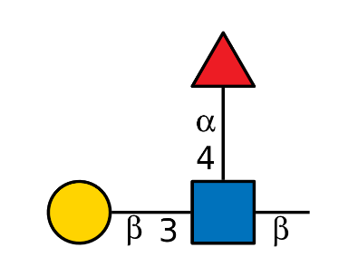

### `red_end`

`red_end` controls the reducing-end annotation. The default `""` draws
the standard reducing-end line. Use `"~"` for a wavy reducing end, or
pass any other string to draw that string at the reducing end.

``` r

draw_cartoon(n_core, red_end = "~")
```

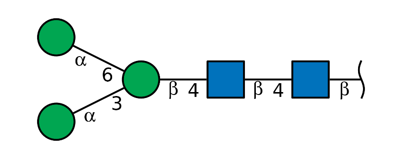

``` r

draw_cartoon(n_core, red_end = "R")
```

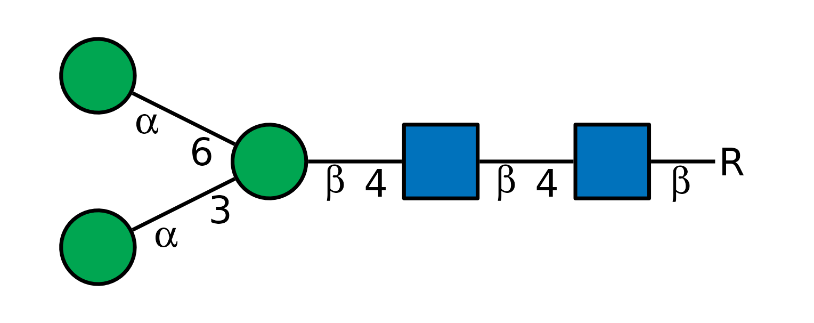

### `edge_linewidth` and `node_linewidth`

`edge_linewidth` controls linkage line width. `node_linewidth` controls
the border width of residue symbols.

``` r

draw_cartoon(
  n_core,
  edge_linewidth = 1.4,
  node_linewidth = 0.4
)
```

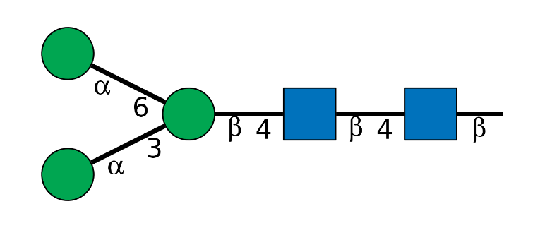

### `node_size`

`node_size` is a multiplier for the default residue-symbol size. The
default is `1`. Larger nodes keep the same cartoon layout but draw
larger symbols.

``` r

draw_cartoon(n_core, node_size = 1.2)
```

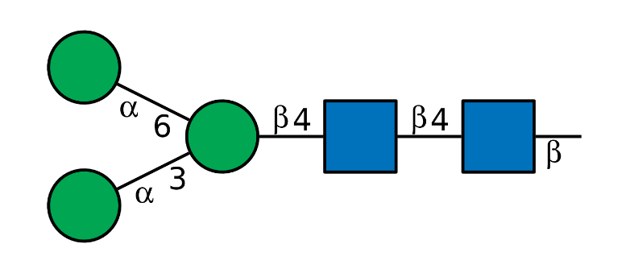

``` r

draw_cartoon(n_core, node_size = 1.6)
#> Warning: Linkage annotations are hidden because `node_size` is larger than 1.2.
#> ℹ Set `show_linkage = FALSE` to silence this warning, or use a smaller
#>   `node_size`.
```

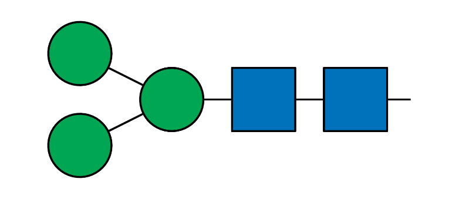

Very large symbols can overlap, so values larger than `2` are rejected.
Linkage annotations are hidden with a warning when the requested node
size leaves too little annotation space.

### `colors`

`colors` is an optional named character vector for overriding
monosaccharide fill colors. Names must be supported monosaccharide
names. Only the names you provide are changed; all other monosaccharides
keep their default SNFG colors.

``` r

draw_cartoon(
  n_core,
  colors = c(Man = "#4DAF4A", GlcNAc = "#377EB8")
)
```

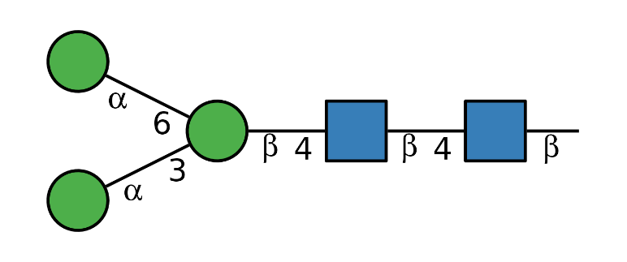

### `highlight`

`highlight` marks selected residue nodes. It is available when
`structure` is a
[`glyrepr::glycan_structure()`](https://glycoverse.github.io/glyrepr/reference/glycan_structure.html)
object. Node indices match the monosaccharide order in the printed
IUPAC-condensed structure.

``` r

highlight_glycan <- glyrepr::as_glycan_structure(
  "Gal(b1-3)[GlcNAc(b1-6)]GalNAc(a1-"
)

draw_cartoon(highlight_glycan, highlight = c(1, 3))
```

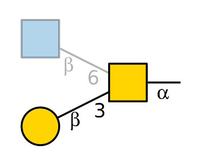

## Save one cartoon

Use
[`save_cartoon()`](https://glycoverse.github.io/glydraw/dev/reference/save_cartoon.md)
when you already have one cartoon object.

``` r

cartoon <- draw_cartoon(n_core, red_end = "~")
outfile <- file.path(tempdir(), "n-core.png")

save_cartoon(cartoon, outfile, scale = 2)
outfile
#> [1] "/tmp/RtmpIU3AzF/n-core.png"
```

`glydraw` does not expose separate `width` and `height` controls because
each cartoon has a natural size calculated from its glycan structure.
`scale` preserves the aspect ratio and relative symbol sizes.

## Export many cartoons

Use
[`export_cartoons()`](https://glycoverse.github.io/glydraw/dev/reference/export_cartoons.md)
to draw and save a vector of glycans in one call. The input can be a
character vector or a
[`glyrepr::glycan_structure()`](https://glycoverse.github.io/glyrepr/reference/glycan_structure.html)
vector.

``` r

glycans <- c(
  core = "Man(a1-3)Man(b1-4)GlcNAc(b1-",
  antenna = "Gal(b1-4)GlcNAc(b1-",
  fucosylated = "Gal(b1-4)[Fuc(a1-3)]GlcNAc(b1-"
)

outdir <- file.path(tempdir(), "glydraw-cartoons")
suppressMessages(
  cartoons <- export_cartoons(
    glycans,
    outdir,
    file_ext = "png",
    scale = 1.5,
    red_end = "~",
    node_size = 1.1
  )
)

list.files(outdir)
#> [1] "antenna.png"     "core.png"        "fucosylated.png"
```

[`export_cartoons()`](https://glycoverse.github.io/glydraw/dev/reference/export_cartoons.md)
creates `dirname` when needed and returns the list of cartoons
invisibly. File names come from vector names when present. Unnamed
inputs use sanitized IUPAC-condensed structure text as file names, and
duplicate names are made unique.
