# Get Started with glydraw

`glydraw` draws SNFG glycan cartoons from glycan structure text or
[`glyrepr::glycan_structure()`](https://glycoverse.github.io/glyrepr/reference/glycan_structure.html)
objects.

[`draw_cartoon()`](https://glycoverse.github.io/glydraw/dev/reference/draw_cartoon.md)
returns a ggplot2 object with class `glydraw_cartoon`. You can print it
directly, pass it to
[`save_cartoon()`](https://glycoverse.github.io/glydraw/dev/reference/save_cartoon.md),
or add ggplot2 layers when needed. This vignette uses IUPAC-condensed
strings because they are compact and easy to copy into examples.

``` r

library(glydraw)
```

## Draw one glycan

The first argument, `structure`, is the glycan to draw. It can be a
character string in a notation supported by
[`glyparse::auto_parse()`](https://glycoverse.github.io/glyparse/reference/auto_parse.html),
or a
[`glyrepr::glycan_structure()`](https://glycoverse.github.io/glyrepr/reference/glycan_structure.html)
value.

``` r

n_core <- "Man(a1-3)[Man(a1-6)]Man(b1-4)GlcNAc(b1-4)GlcNAc(b1-"

draw_cartoon(n_core)
```


For a sketch-like appearance, use
[`draw_cartoon_sketch()`](https://glycoverse.github.io/glydraw/dev/reference/draw_cartoon_sketch.md)
instead of
[`draw_cartoon()`](https://glycoverse.github.io/glydraw/dev/reference/draw_cartoon.md).

``` r

draw_cartoon_sketch(n_core)
```

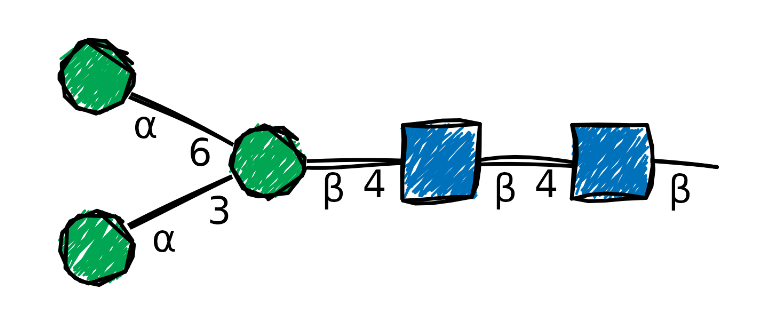

## Basic options

### `show_linkage`

`show_linkage` controls whether glycosidic linkage annotations are
shown. Substituent annotations are always shown.

``` r

draw_cartoon(n_core, show_linkage = FALSE)
```

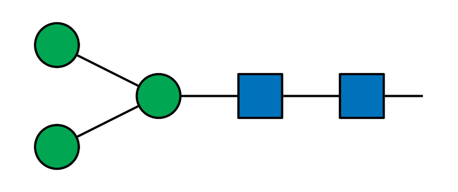

### `orient`

`orient` controls the direction in which the glycan extends from its
reducing end. Choose `"left"`, `"right"`, `"up"`, or `"down"`; the
default is `"left"`.

``` r

draw_cartoon(n_core, orient = "up")
```

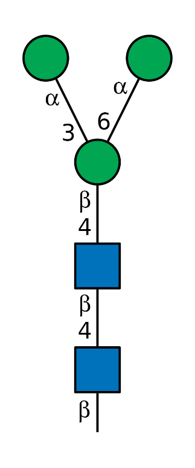

### `red_end` annotation

`red_end` controls what is drawn after the reducing-end line. Possible
values are:

- `""`: draw nothing (the default)
- `"~"`: draw a wavy line
- Any other text: draw that text after the line
- An amino-acid sequence: custom text with one tagged glycosite

``` r

draw_cartoon(n_core, red_end = "")
```

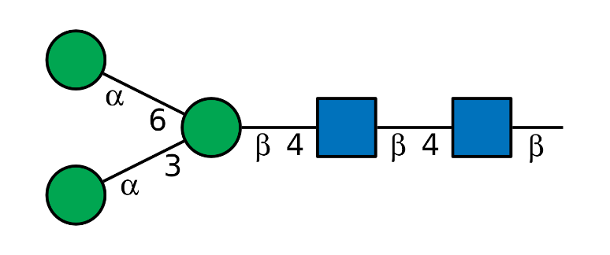

``` r

draw_cartoon(n_core, red_end = "~")
```

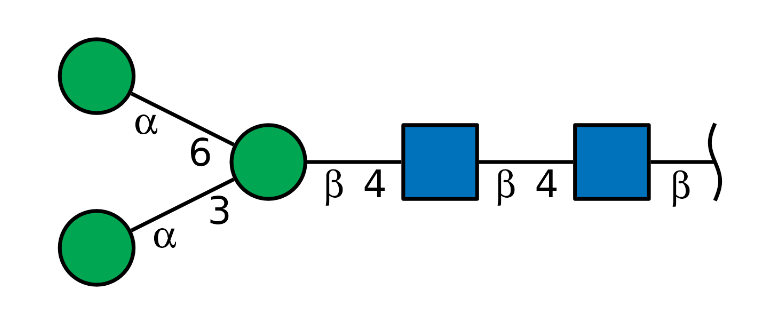

``` r

draw_cartoon(n_core, red_end = "Asn")
```

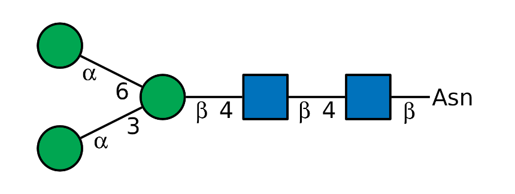

To annotate an amino-acid sequence at the reducing end, wrap the
glycosite in `<site>` and `</site>` tags.

``` r

draw_cartoon(n_core, red_end = "ABC<site>D</site>EFJHI")
```

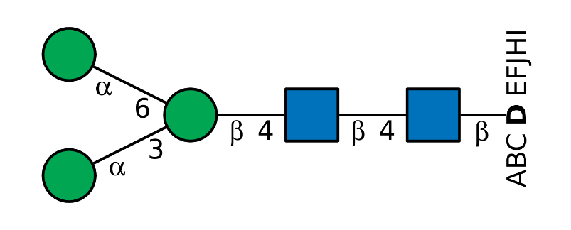

Although this notation is slightly verbose, it lets you use arbitrary
characters in the sequence without ambiguity.

``` r

draw_cartoon(n_core, red_end = "<site>N</site>-X-S/T")
```

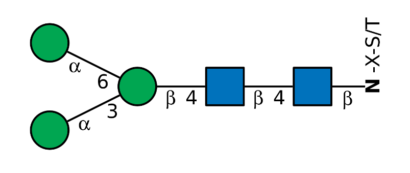

## Styles

`glydraw` provides many additional visual options, including linewidths,
node sizes, colors, and fonts. The style system collects these options
while preserving the information conveyed by the glycan notation.

Use the `style` argument to apply these customizations. By default,
`style = style_glydraw()`, which returns a style object containing the
available settings.

``` r

style_glydraw()
#> $fuc_orient
#> [1] "flex"
#> 
#> $red_end
#> [1] ""
#> 
#> $edge_linewidth
#> [1] 0.8
#> 
#> $node_linewidth
#> [1] 0.8
#> 
#> $node_size
#> [1] 1
#> 
#> $font_family
#> [1] ""
#> 
#> $colors
#>     glyWhite      glyBlue     glyGreen    glyYellow    glyOrange      glyPink 
#>    "#FFFFFF"    "#0072BC"    "#00A651"    "#FFD400"    "#F47920"    "#F69EA1" 
#>    glyPurple glyLightBlue     glyBrown       glyRed 
#>    "#A54399"    "#8FCCE9"    "#A17A4D"    "#ED1C24" 
#> 
#> $red_end_length
#> [1] 0.6
#> 
#> $red_end_size
#> [1] 6
#> 
#> attr(,"class")
#> [1] "glydraw_style"
```

The style contains the following parameters:

- `fuc_orient`: orientation of Fuc-like residues
- `red_end`: reducing-end annotation, as described above
- `red_end_length`: length of the reducing-end line
- `red_end_size`: size of custom reducing-end text
- `edge_linewidth`: linewidth of glycosidic linkages
- `node_linewidth`: linewidth of node borders
- `node_size`: multiplier for node size
- `font_family`: font family for text annotations
- `colors`: palette used to fill the nodes

The following sections describe these settings in more detail.

### `fuc_orient`

`fuc_orient` controls how Fuc-like triangles are rotated. The default,
`"flex"`, points non-reducing Fuc residues toward their rendered linkage
direction. Use `"up"` when every Fuc triangle should point upward.

``` r

fucosylated <- "Gal(b1-3)[Fuc(a1-4)]GlcNAc(b1-"

draw_cartoon(fucosylated, style = style_glydraw(fuc_orient = "flex"))
```

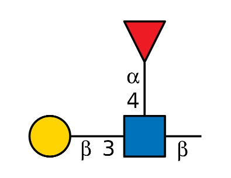

``` r

draw_cartoon(fucosylated, style = style_glydraw(fuc_orient = "up"))
```

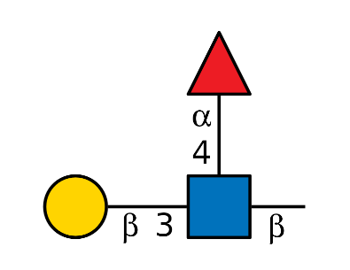

### `red_end` in a style

This setting controls the same feature as the `red_end` argument
described above. It is also available in the style object so that it can
be reused across drawings. The explicit `red_end` argument in
[`draw_cartoon()`](https://glycoverse.github.io/glydraw/dev/reference/draw_cartoon.md)
overrides `style$red_end`.

``` r

# The explicit argument overrides the style setting.
draw_cartoon(n_core, red_end = "Asn", style = style_glydraw(red_end = "~"))
```


### `red_end_length`

`red_end_length` is the length of the reducing-end line in
plot-coordinate units. It can be any non-negative number. Setting it to
`0` omits the line and any reducing-end wave or custom text while
retaining the core anomer annotation.

``` r

draw_cartoon(n_core, style = style_glydraw(red_end_length = 1))
```

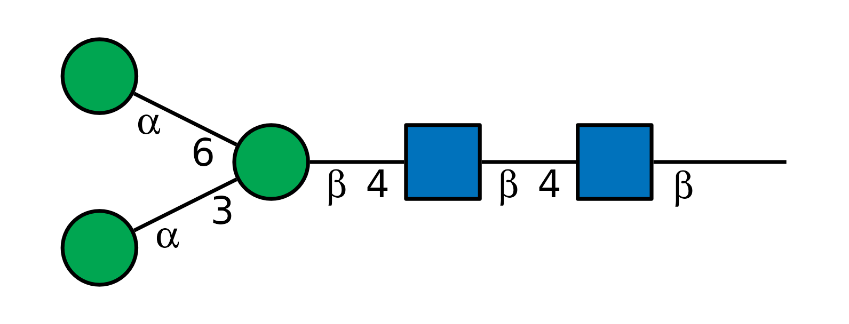

``` r

# The custom text is omitted when `red_end_length = 0`.
draw_cartoon(n_core, red_end = "Asn", style = style_glydraw(red_end_length = 0))
```

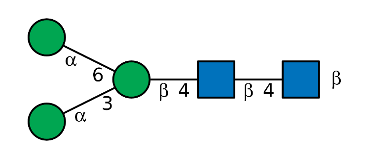

### `red_end_size`

`red_end_size` controls the size of custom text passed through
`red_end`. It does not affect the `"~"` wave.

``` r

draw_cartoon(n_core, red_end = "Asn", style = style_glydraw(red_end_size = 10))
```

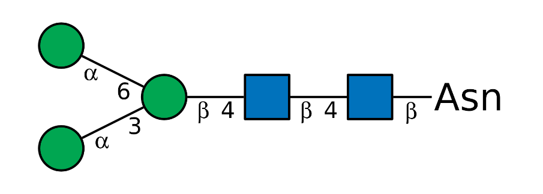

### `edge_linewidth` and `node_linewidth`

`edge_linewidth` controls linkage line width. `node_linewidth` controls
the border width of residue symbols.

``` r

draw_cartoon(
  n_core,
  style = style_glydraw(
    edge_linewidth = 1.4,
    node_linewidth = 0.4
  )
)
```

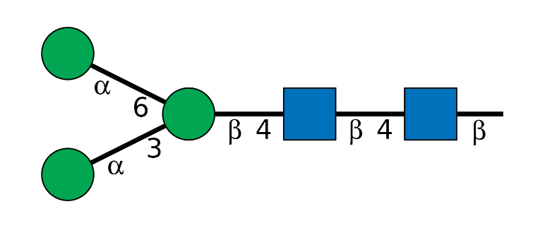

### `node_size`

`node_size` is a multiplier for the default residue-symbol size. The
default is `1`. Larger nodes keep the same cartoon layout but draw
larger symbols.

``` r

draw_cartoon(n_core, style = style_glydraw(node_size = 1.2))
```

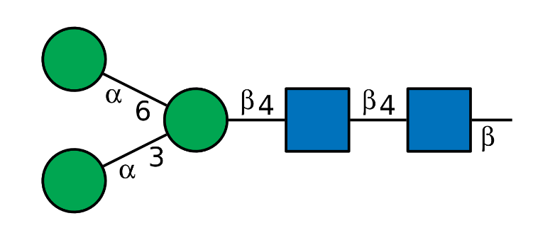

``` r

draw_cartoon(n_core, style = style_glydraw(node_size = 1.6))
#> Warning: Linkage annotations are hidden because `node_size` is larger than 1.4.
#> ℹ Set `show_linkage = FALSE` to silence this warning, or use a smaller
#>   `node_size`.
```

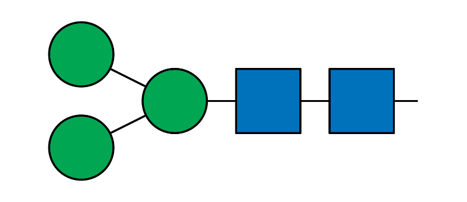

Very large symbols can overlap, so values larger than `2` are rejected.
Linkage annotations are hidden with a warning when the requested node
size leaves too little annotation space.

**Tip:** To make a compact cartoon while keeping the symbols legible,
increase `node_size`, `node_linewidth`, and `edge_linewidth`. If linkage
information is not essential for the display, also set
`show_linkage = FALSE`. This makes sure the cartoon still looks nice
when you shrink in Adobe Illustration.

``` r

compact_style <- style_glydraw(
  node_size = 1.4,
  edge_linewidth = 1.5,
  node_linewidth = 1.5
)
draw_cartoon(n_core, show_linkage = FALSE, style = compact_style)
```

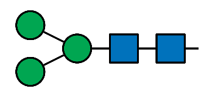

### `colors`

`colors` is a complete named palette in the format returned by
[`glydraw_colors()`](https://glycoverse.github.io/glydraw/dev/reference/glydraw_colors.md).
Modify entries in that palette to customize the corresponding residue
colors. By default,
[`glydraw_colors()`](https://glycoverse.github.io/glydraw/dev/reference/glydraw_colors.md)
uses the colors defined by
[SNFG](https://www.ncbi.nlm.nih.gov/glycans/snfg.html).

``` r

colors <- glydraw_colors()
colors[c("glyGreen", "glyBlue")] <- c("#4DAF4A", "#377EB8")

draw_cartoon(
  n_core,
  style = style_glydraw(colors = colors)
)
```

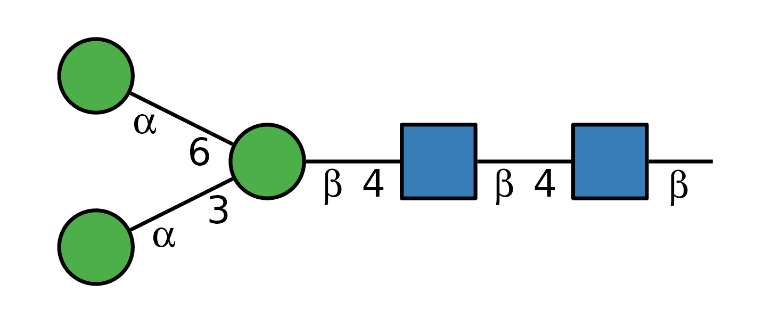

### Reusing styles

Create a style object once and reuse it for multiple glycans.

``` r

glycans <- c(
  core = n_core,
  antenna = "Gal(b1-4)GlcNAc(b1-",
  fucosylated = "Gal(b1-4)[Fuc(a1-3)]GlcNAc(b1-"
)

my_style <- style_glydraw(
  node_size = 1.4,
  edge_linewidth = 1.5,
  node_linewidth = 1.5
)

draw_cartoon(glycans[[1]], style = my_style)
draw_cartoon(glycans[[2]], style = my_style)
draw_cartoon(glycans[[3]], style = my_style)
```

### Bundled styles

`glydraw` also provides presets based on common glycan-drawing
conventions.

``` r

draw_cartoon(n_core, style = style_glygen())
```

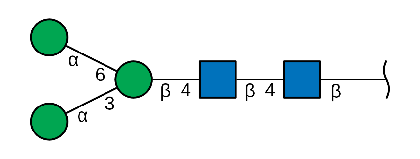

``` r

draw_cartoon(n_core, style = style_snfg())
```

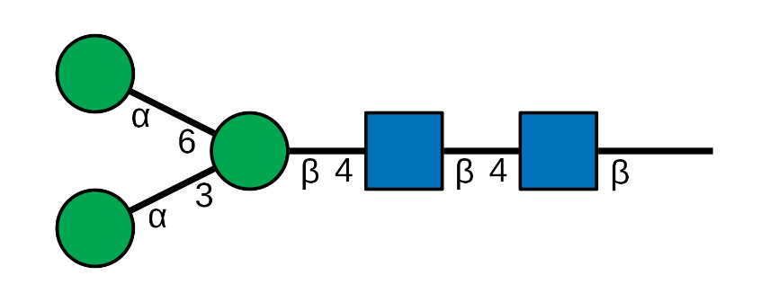

``` r

draw_cartoon(n_core, style = style_glycoworkbench())
```

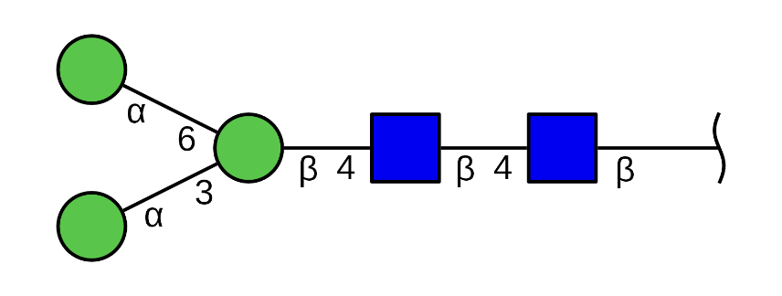

These styles can also be used with
[`draw_cartoon_sketch()`](https://glycoverse.github.io/glydraw/dev/reference/draw_cartoon_sketch.md).

``` r

draw_cartoon_sketch(n_core, style = style_glycoworkbench())
```

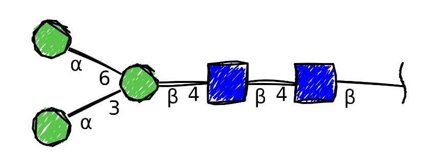

## Node highlighting

`highlight` marks selected residue nodes. It is available when
`structure` is a
[`glyrepr::glycan_structure()`](https://glycoverse.github.io/glyrepr/reference/glycan_structure.html)
object. Node indices match the monosaccharide order in the printed
IUPAC-condensed structure.

``` r

highlight_glycan <- glyrepr::as_glycan_structure(
  "Gal(b1-3)[GlcNAc(b1-6)]GalNAc(a1-"
)

draw_cartoon(highlight_glycan, highlight = c(1, 3))
```

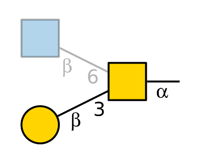

## Save one cartoon

Use
[`save_cartoon()`](https://glycoverse.github.io/glydraw/dev/reference/save_cartoon.md)
when you already have one cartoon object.

``` r

cartoon <- draw_cartoon(n_core, style = style_glydraw(red_end = "~"))
outfile <- file.path(tempdir(), "n-core.png")

save_cartoon(cartoon, outfile, scale = 2)
outfile
#> [1] "/tmp/RtmpWoSk4m/n-core.png"
```

`glydraw` does not expose separate `width` and `height` controls because
each cartoon has a natural size calculated from its glycan structure.
`scale` preserves the aspect ratio and relative symbol sizes.

## Export many cartoons

Use
[`export_cartoons()`](https://glycoverse.github.io/glydraw/dev/reference/export_cartoons.md)
to draw and save a vector of glycans in one call. The input can be a
character vector or a
[`glyrepr::glycan_structure()`](https://glycoverse.github.io/glyrepr/reference/glycan_structure.html)
vector.

``` r

glycans <- c(
  core = "Man(a1-3)Man(b1-4)GlcNAc(b1-",
  antenna = "Gal(b1-4)GlcNAc(b1-",
  fucosylated = "Gal(b1-4)[Fuc(a1-3)]GlcNAc(b1-"
)

outdir <- file.path(tempdir(), "glydraw-cartoons")
suppressMessages(
  cartoons <- export_cartoons(
    glycans,
    outdir,
    file_ext = "png",
    scale = 1.5,
    style = style_glydraw(red_end = "~", node_size = 1.1)
  )
)

list.files(outdir)
#> [1] "antenna.png"     "core.png"        "fucosylated.png"
```

[`export_cartoons()`](https://glycoverse.github.io/glydraw/dev/reference/export_cartoons.md)
creates `dirname` when needed and returns the list of cartoons
invisibly. File names come from vector names when present. Unnamed
inputs use sanitized IUPAC-condensed structure text as file names, and
duplicate names are made unique.
