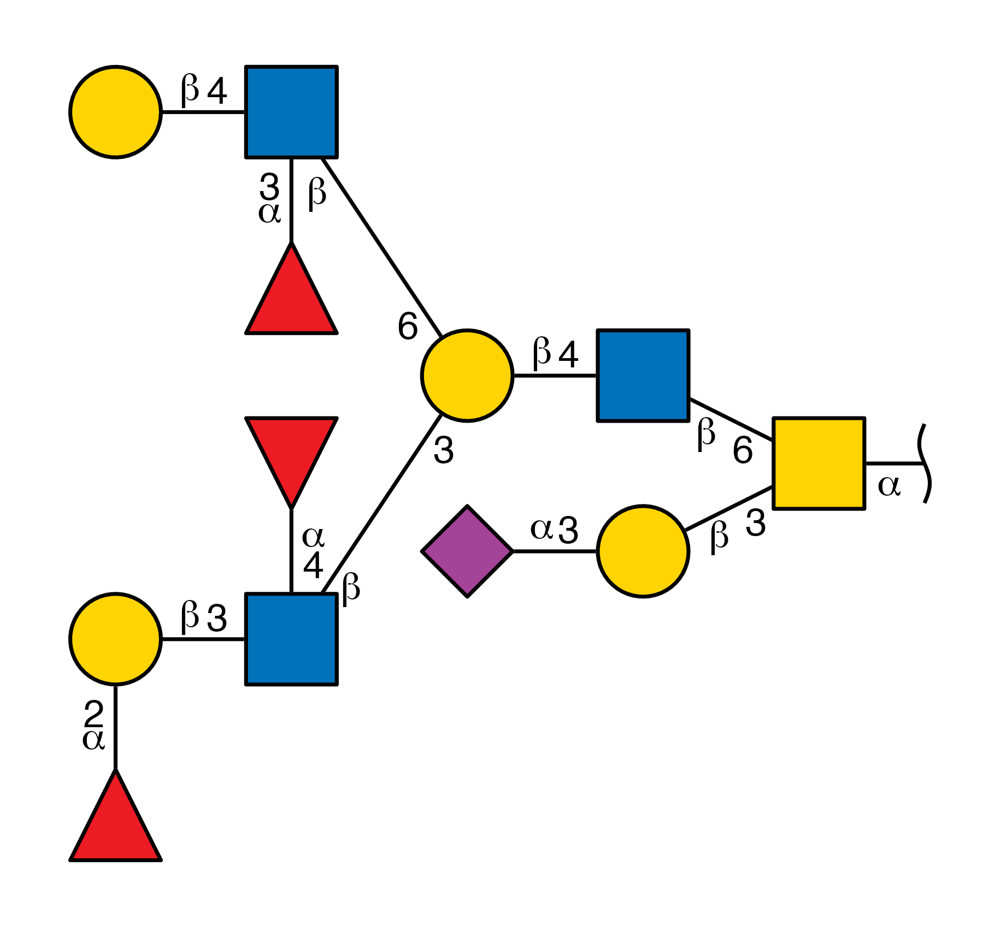
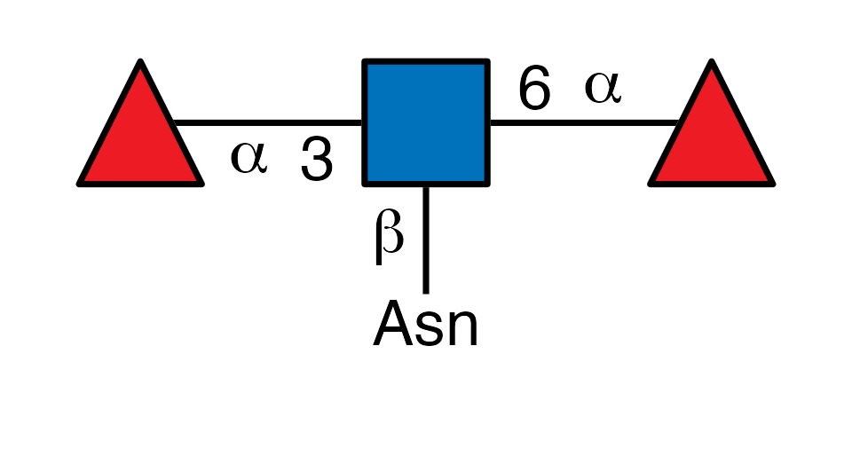
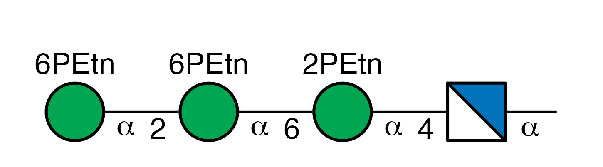
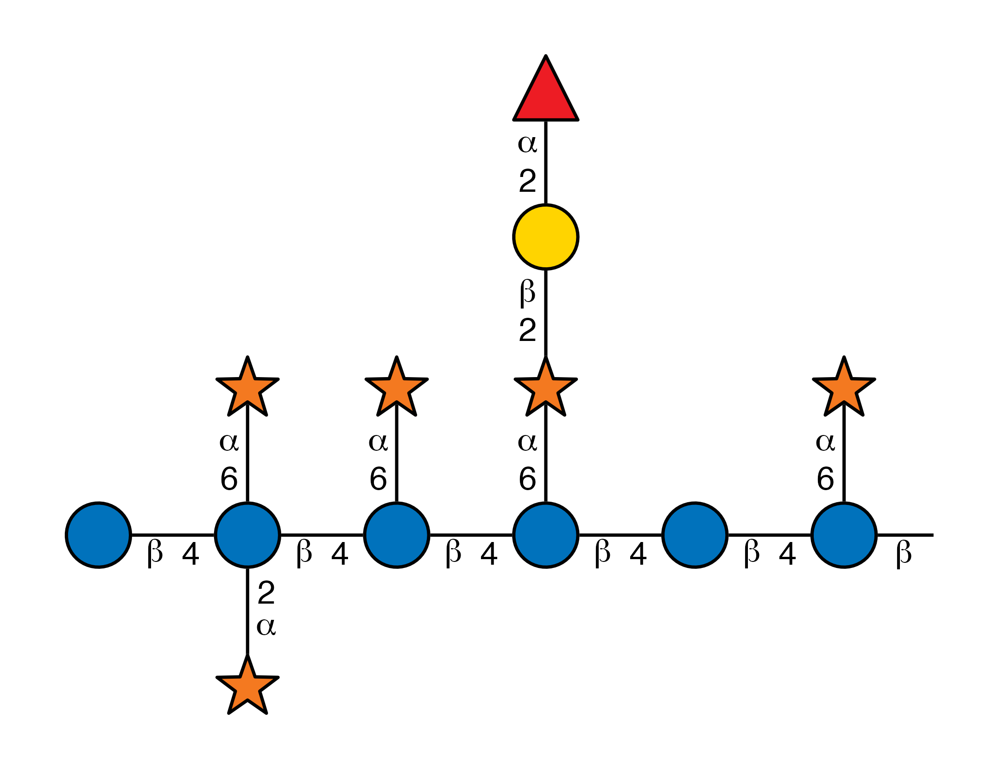

# glydraw

`glydraw` is a ggplot2-native R engine for drawing reproducible SNFG
glycan cartoons from glycan structure objects or text notations, with
support for batch export, structural highlighting, and deep appearance
customization.

## Installation

### Install glycoverse

We recommend installing the meta-package
[glycoverse](https://github.com/glycoverse/glycoverse), which includes
this package and other core glycoverse packages.

### Install glydraw alone

If you don’t want to install all glycoverse packages, you can only
install glydraw.

You can install the latest release of glydraw from CRAN:

``` r

install.packages("glydraw")
```

Or from [r-universe](https://glycoverse.r-universe.dev/glydraw):

``` r

install.packages('glydraw', repos = c('https://glycoverse.r-universe.dev', 'https://cloud.r-project.org'))
```

Or from [GitHub](https://github.com/glycoverse/glydraw):

``` r

remotes::install_github("glycoverse/glydraw@*release")
```

Or install the development version:

``` r

remotes::install_github("glycoverse/glydraw")
```

## Example

``` r

library(glydraw)

glycan <- paste0(
  "Glc(a1-2)Glc(a1-3)Glc(a1-3)Man(a1-2)Man(a1-2)Man(a1-3)[Man(a1-2)Man(a1-3)",
  "[Man(a1-2)Man(a1-6)]Man(a1-6)]Man(b1-4)GlcNAc(b1-4)GlcNAc(a1-"
)
draw_cartoon(glycan, red_end = "PP-Dol")
```


``` r

glycan <- paste0(
  "Neu5Ac(a2-3)Gal(b1-3)[Fuc(a1-2)Gal(b1-3)[Fuc(a1-4)]GlcNAc(b1-3)",
  "[Gal(b1-4)[Fuc(a1-3)]GlcNAc(b1-6)]Gal(b1-4)GlcNAc(b1-6)]GalNAc(a1-"
)
draw_cartoon(glycan, red_end = "~", node_size = 1.2)
```



``` r

glycan <- "Gal(b1-3)[Neu5Ac(a2-3)Gal6S(b1-4)[Fuc(a1-3)]GlcNAc(b1-6)]GalNAc(a1-"
draw_cartoon(glycan, orient = "V", red_end = "Ser/Thr")
```


``` r

glycan <- "Fuc(a1-3)[Fuc(a1-6)]GlcNAc(b1-"
draw_cartoon(glycan, orient = "V", red_end = "Asn", fuc_orient = "up")
```



``` r

glycan <- paste0(
  "WURCS=2.0/3,4,3/[a2122h-1a_1-5_2*N][a1122h-1a_1-5_2*OP^XOCCN/3O/3=O]",
  "[a1122h-1a_1-5_6*OP^XOCCN/3O/3=O]/1-2-3-3/a4-b1_b6-c1_c2-d1"
)
draw_cartoon(glycan)
```



``` r

glycan <- "Glc(b1-4)[Xyl(a1-6)][Xyl(a1-2)]Glc(b1-4)[Xyl(a1-6)]Glc(b1-4)[Fuc(a1-2)Gal(b1-2)Xyl(a1-6)]Glc(b1-4)Glc(b1-4)[Xyl(a1-6)]Glc(b1-"
draw_cartoon(glycan, fuc_orient = "up")
```


