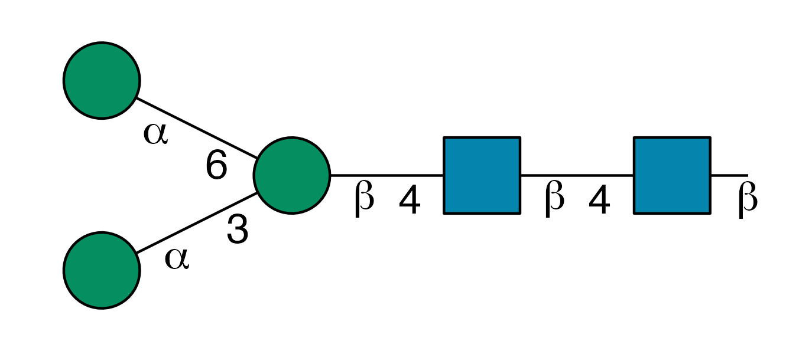

# glydraw

The goal of glydraw is to draw published-ready Structure Nomenclature
For Glycans (SNFG). We use ggplot2 as the backend to draw the cartoons.

## Installation

### Install glycoverse

We recommend installing the meta-package
[glycoverse](https://github.com/glycoverse/glycoverse), which includes
this package and other core glycoverse packages.

### Install glydraw alone

If you don’t want to install all glycoverse packages, you can only
install glydraw.

You can install the latest release of glydraw from
[r-universe](https://glycoverse.r-universe.dev/glydraw)
(**recommended**):

``` r
# install.packages("pak")
pak::repo_add(glycoverse = "https://glycoverse.r-universe.dev")
pak::pkg_install("glydraw")
```

Or from [GitHub](https://github.com/glycoverse/glydraw):

``` r
pak::pkg_install("glycoverse/glydraw@*release")
```

Or install the development version (NOT recommended):

``` r
pak::pkg_install("glycoverse/glydraw")
```

**Note:** Tips and troubleshooting for the meta-package
[glycoverse](https://github.com/glycoverse/glycoverse) are also
applicable here: [Installation of
glycoverse](https://github.com/glycoverse/glycoverse#installation).

## Example

Call
[`draw_cartoon()`](https://glycoverse.github.io/glydraw/dev/reference/draw_cartoon.md)
to plot a SNFG:

``` r
library(glydraw)

draw_cartoon("Man(a1-3)[Man(a1-6)]Man(b1-4)GlcNAc(b1-4)GlcNAc(b1-")
```



And call
[`save_cartoon()`](https://glycoverse.github.io/glydraw/dev/reference/save_cartoon.md)
to save it to a file:

``` r
cartoon <- draw_cartoon("Man(a1-3)[Man(a1-6)]Man(b1-4)GlcNAc(b1-4)GlcNAc(b1-")
save_cartoon(cartoon, "N-core.png", dpi = 300)
```
